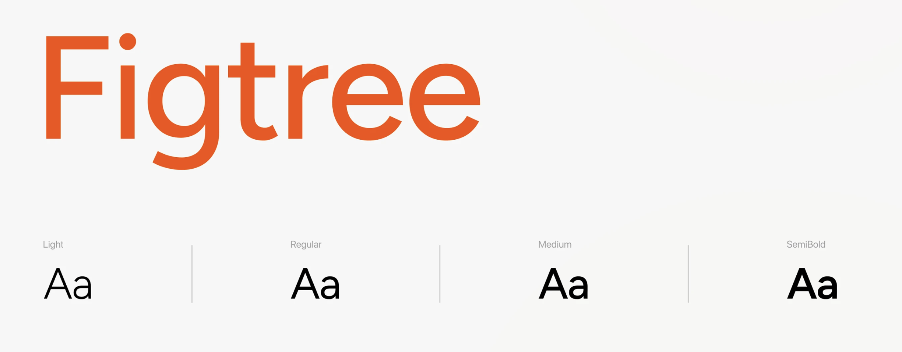
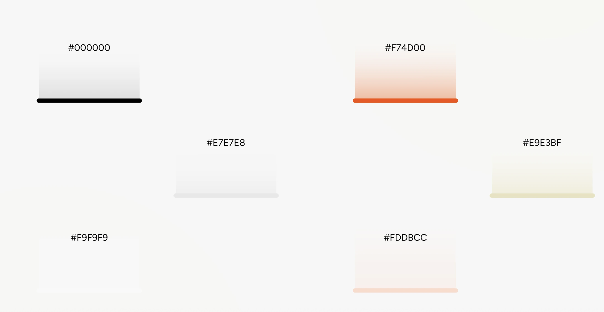

# Guia de referência de design

- **Projeto:** MCP-canva / Ateliê Canva
- **Status:** Referência visual para implementação
- **Data:** 23 de setembro de 2026
- **Fontes visuais:** `resources/docs/referencia-design/ref_1.png` a `ref_4.png`

## 1. Finalidade

Este documento transforma as imagens de referência em um sistema de design
aplicável ao front do Ateliê Canva. Ele deve orientar novas telas, componentes,
estados, revisões visuais e futuras alterações de CSS.

As imagens definem explicitamente a família tipográfica e a paleta principal.
Dimensões, espaçamentos, raios e sombras foram inferidos visualmente e devem ser
tratados como valores de implementação recomendados, não como medidas extraídas
de um arquivo-fonte de design.


## 2. Direção visual

A linguagem visual é clara, funcional e orientada a produto:

- superfícies `#F9F9F9` sobre fundo `#E7E7E8`;
- preto como cor principal de ação e texto;
- laranja intenso para marca, seleção e destaque;
- bordas finas e sombras discretas;
- cards grandes, arejados e com cantos arredondados;
- controles em formato de cápsula;
- iconografia linear simples;
- hierarquia construída por tamanho, peso e espaço, não por excesso de cores;
- alta densidade de informação sem aparência pesada.

Para o Ateliê Canva, essa direção deve transmitir agilidade, criatividade e
controle. O usuário escreve um briefing, compara opções e escolhe o que será
criado; a interface deve parecer uma ferramenta de trabalho, não uma landing
page promocional.

## 3. Princípios

### 3.1 Clareza antes de decoração

Cada superfície deve ter uma função evidente. Ornamentos só entram quando
ajudarem a separar contexto, reforçar estado ou guiar a ação.

### 3.2 Uma ação dominante por área

Cada card ou etapa deve ter no máximo uma ação primária. Ações secundárias usam
contorno, texto ou ícone.

### 3.3 Laranja indica direção

O laranja identifica marca, item ativo, progresso ou seleção. Ele não deve ser
usado em grandes áreas nem competir com múltiplos elementos simultâneos.

### 3.4 Preto conclui ações

Botões pretos representam ações fortes e definitivas, como criar, confirmar,
usar um design ou concluir uma etapa.

### 3.5 Escolha humana visível

Nenhum candidato de design deve parecer pré-selecionado. O estado escolhido só
aparece depois de uma ação explícita do usuário.

## 4. Tipografia

A família indicada nas referências é **Figtree**.



### 4.1 Família e fallback

```css
font-family: "Figtree", Inter, ui-sans-serif, system-ui, -apple-system,
  BlinkMacSystemFont, "Segoe UI", sans-serif;
```

Carregar apenas os pesos utilizados:

- `300` — Light;
- `400` — Regular;
- `500` — Medium;
- `600` — SemiBold.

Evitar pesos 700–900. A referência cria ênfase principalmente com tamanho,
contraste e SemiBold.

### 4.2 Escala tipográfica

| Token | Tamanho / linha | Peso | Uso |
|---|---:|---:|---|
| `display-lg` | 48 / 56 px | 500 | Títulos de boas-vindas ou estados vazios amplos |
| `heading-xl` | 36 / 44 px | 500 | Título principal da página |
| `heading-lg` | 28 / 36 px | 500 | Título de painel ou etapa |
| `heading-md` | 22 / 30 px | 500 | Título de card importante |
| `heading-sm` | 18 / 26 px | 600 | Título de card comum |
| `body-lg` | 18 / 28 px | 400 | Introdução e texto de apoio destacado |
| `body-md` | 16 / 24 px | 400 | Texto padrão, inputs e botões |
| `body-sm` | 14 / 20 px | 400 | Metadados e descrições compactas |
| `label-md` | 14 / 20 px | 600 | Labels, tabs e botões compactos |
| `caption` | 12 / 16 px | 400 | Horários, contadores e ajuda |

Regras:

- títulos usam `letter-spacing: -0.02em` a `-0.03em`;
- corpo usa espaçamento normal;
- rótulos não devem ser escritos inteiramente em caixa alta;
- parágrafos devem ter no máximo 65–75 caracteres por linha;
- números de métricas podem usar peso 500 e tamanho entre 32 e 40 px.

## 5. Cores

A paleta abaixo aparece explicitamente nas referências.



### 5.1 Paleta principal

| Token | Hex | Uso recomendado |
|---|---|---|
| `color-ink` | `#000000` | Texto principal, ícones fortes e botões primários |
| `color-brand` | `#F74D00` | Marca, seleção, progresso e destaque |
| `color-border` | `#E7E7E8` | Bordas, divisores e estados inativos |
| `color-accent-soft` | `#E9E3BF` | Destaque editorial ou aviso suave |
| `color-surface` | `#F9F9F9` | Cards, cabeçalho, sidebar e campos |
| `color-brand-soft` | `#FDDBCC` | Fundo de ícones, chips e seleção suave |

### 5.2 Regra de uso exclusivo

Nenhuma outra cor deve ser adicionada ao produto. Variações de hierarquia usam
somente opacidade aplicada a uma das seis cores da paleta, principalmente ao
preto.

- texto principal: `#000000` com 100% de opacidade;
- texto secundário: `#000000` com 62% de opacidade;
- placeholder e metadado: `#000000` com 44% de opacidade;
- conteúdo desabilitado: `#000000` com 32% de opacidade;
- overlay: `#000000` com 44% de opacidade;
- sombra: `#000000` com 5% a 7% de opacidade;
- foco: `#F74D00` com 22% de opacidade no anel externo.

### 5.3 Estados sem novas cores

Sucesso, informação, atenção e erro também usam exclusivamente a paleta. O
significado deve ser reforçado por ícone, rótulo e mensagem:

| Estado | Cor | Fundo | Reforço obrigatório |
|---|---|---|---|
| Sucesso | `#000000` | `#E9E3BF` | Ícone de check + texto “Concluído” |
| Informação | `#000000` | `#E7E7E8` | Ícone de informação + descrição |
| Atenção | `#000000` | `#E9E3BF` | Ícone de atenção + orientação |
| Erro | `#F74D00` | `#FDDBCC` | Ícone de erro + mensagem específica |

Sempre combinar cor com texto e/ou ícone. Nunca depender somente da cor.

### 5.4 Contraste

- Preto em `#F9F9F9`: contraste aproximado de `19.95:1`.
- Preto em `#F74D00`: contraste aproximado de `6.02:1`.

Por isso, texto sobre laranja deve usar preto. Em botões pretos, usar `#F9F9F9`
como texto de alto contraste.

## 6. Tokens CSS

```css
:root {
  --font-sans: "Figtree", Inter, ui-sans-serif, system-ui, sans-serif;

  --color-ink: #000000;
  --color-brand: #f74d00;
  --color-border: #e7e7e8;
  --color-accent-soft: #e9e3bf;
  --color-canvas: #e7e7e8;
  --color-brand-soft: #fddbcc;
  --color-surface: #f9f9f9;

  --opacity-secondary: 0.62;
  --opacity-muted: 0.44;
  --opacity-disabled: 0.32;

  --space-1: 4px;
  --space-2: 8px;
  --space-3: 12px;
  --space-4: 16px;
  --space-5: 20px;
  --space-6: 24px;
  --space-8: 32px;
  --space-10: 40px;
  --space-12: 48px;
  --space-16: 64px;

  --radius-sm: 8px;
  --radius-md: 12px;
  --radius-lg: 16px;
  --radius-xl: 20px;
  --radius-pill: 999px;

  --shadow-sm: 0 2px 8px rgb(0 0 0 / 5%);
  --shadow-md: 0 10px 30px rgb(0 0 0 / 7%);
  --focus-ring: 0 0 0 3px rgb(247 77 0 / 22%);

  --duration-fast: 120ms;
  --duration-normal: 180ms;
  --ease-standard: cubic-bezier(0.2, 0, 0, 1);
}
```

## 7. Espaçamento e composição

Usar uma grade base de `4px`, com preferência por múltiplos de `8px`.

- distância entre ícone e texto: 8–12 px;
- espaçamento interno de controles: 12–16 px;
- espaçamento interno de cards compactos: 20–24 px;
- espaçamento interno de painéis: 28–32 px;
- intervalo entre cards: 16–24 px;
- intervalo entre seções: 32–48 px;
- margem do conteúdo em desktop: 32–48 px;
- margem em mobile: 16–20 px.

Evitar empilhar bordas. Quando dois grupos já estiverem separados por fundo,
espaço ou card, não adicionar um divisor sem necessidade.

## 8. Estrutura da aplicação

### 8.1 Desktop amplo

```text
┌─────────┬──────────────────────────────────────────────────────┐
│         │ Topbar: navegação, créditos, notificações e usuário │
│ Sidebar ├──────────────────────────────────────────────────────┤
│ 72–88px │ Conteúdo principal                                  │
│         │                                                      │
└─────────┴──────────────────────────────────────────────────────┘
```

- sidebar fixa, em `#F9F9F9`, separada por borda direita;
- topbar em `#F9F9F9`, entre 72 e 80 px de altura;
- conteúdo sobre `color-canvas`;
- largura de conteúdo fluida, com máximo entre 1600 e 1760 px;
- grids principais de 12 colunas;
- painel lateral ocupa aproximadamente 4 colunas;
- conteúdo principal ocupa aproximadamente 8 colunas.

### 8.2 Aplicação no Ateliê Canva

No fluxo atual, usar:

- coluna de briefing entre 360 e 440 px;
- coluna de candidatos flexível;
- cards de candidatos em 2 colunas acima de 1100 px;
- 1 coluna entre 720 e 1099 px;
- formulário e resultados empilhados abaixo de 720 px.

### 8.3 Responsividade

| Faixa | Comportamento |
|---|---|
| `≥ 1440px` | Sidebar, topbar completa e conteúdo em 12 colunas |
| `1100–1439px` | Navegação textual reduzida e painéis mais compactos |
| `720–1099px` | Sidebar compacta; conteúdo principal em uma coluna |
| `< 720px` | Sidebar vira barra inferior ou menu; cards e ações ocupam toda a largura |

Em mobile:

- botões principais ficam com largura total;
- ações secundárias podem ser empilhadas;
- áreas clicáveis têm no mínimo 44 × 44 px;
- tabelas viram cards ou listas de definição;
- nenhuma informação depende de hover.

## 9. Superfícies, bordas e elevação

### Cards

- fundo `#F9F9F9`;
- raio de 16–20 px;
- borda `1px solid transparent` por padrão;
- borda `#E7E7E8` quando for necessário delimitar;
- sombra discreta apenas quando o card estiver elevado;
- sem gradientes decorativos.

### Painéis grandes

- raio de 20 px;
- padding de 28–32 px;
- títulos no topo esquerdo;
- ação contextual no topo direito;
- conteúdo alinhado a uma grade interna.

### Divisores

- 1 px;
- `#E7E7E8`;
- usar entre regiões funcionais, nunca entre todos os itens de uma lista.

## 10. Componentes

### 10.1 Botão primário preto

Uso: criar design, confirmar escolha, concluir ou salvar.

```text
altura: 48–52 px
padding horizontal: 20–28 px
raio: 999 px
fundo: #000000
texto: #F9F9F9
peso: 500 ou 600
```

Estados:

- hover: manter `#000000`, aplicar opacidade de 88% e deslocamento máximo de 1 px;
- active: manter `#000000` com 100% de opacidade e sem deslocamento;
- focus: anel laranja externo;
- disabled: fundo `#E7E7E8`, texto `#000000` com 32% de opacidade;
- loading: manter largura e trocar conteúdo por spinner + verbo no gerúndio.

### 10.2 Botão de marca

Uso: crédito, estado ativo ou ação de alta visibilidade não destrutiva.

- fundo `#F74D00`;
- texto preto para elementos pequenos;
- ícone opcional dentro de círculo suave;
- formato de cápsula;
- não usar ao lado de outro botão laranja igualmente forte.

### 10.3 Botão secundário

- fundo `#F9F9F9`;
- borda `#E7E7E8`;
- texto preto;
- ícone linear à esquerda;
- hover com fundo `#E7E7E8` e borda `#000000`.

### 10.4 Botão de ícone

- 44–48 px;
- circular;
- borda neutra;
- ícone de 20–22 px;
- `aria-label` obrigatório;
- tooltip para ações que não sejam universalmente reconhecidas.

### 10.5 Inputs e selects

- altura mínima de 48 px;
- fundo `#F9F9F9`;
- borda `#E7E7E8`;
- raio de 10–12 px;
- padding horizontal de 14–16 px;
- label acima do campo, nunca apenas placeholder;
- foco com borda laranja e `--focus-ring`;
- erro com texto descritivo abaixo do campo;
- campos longos podem usar 56 px.

Textareas seguem a mesma linguagem, com altura inicial de 144–176 px e resize
vertical.

### 10.6 Upload / dropzone

Inspirado na tela de upload da referência:

- fundo `#FDDBCC`;
- borda tracejada laranja;
- raio de 14–16 px;
- ícone de upload circular laranja;
- instrução principal centralizada;
- link **Procurar** com contraste de link;
- formatos aceitos e limites em texto auxiliar;
- progresso em card próprio, com nome, tamanho, percentual, tempo e cancelar.

No fluxo de vídeo, explicar dentro da dropzone que o Canva exige uma URL pública
HTTPS quando o upload não for intermediado por armazenamento temporário.

### 10.7 Tabs e controle segmentado

- container com fundo neutro e raio de cápsula;
- tab ativa com fundo laranja ou preto;
- tab inativa com texto secundário;
- contador dentro de círculo ou chip de alto contraste;
- teclado: setas mudam opção e `Enter`/`Space` ativam quando aplicável.

### 10.8 Chips e tags

- altura de 28–34 px;
- raio de 8–999 px, conforme densidade;
- fundo `#F9F9F9` ou `#FDDBCC`;
- texto de 12–14 px;
- chip removível tem botão independente com área clicável adequada;
- não usar chip como substituto de botão quando houver ação principal.

### 10.9 Card de métrica

- ícone em círculo com fundo `#FDDBCC`;
- número em 32–40 px, peso 500;
- legenda em 14–16 px e cor secundária;
- card `#F9F9F9` sem sombra forte;
- valores alinhados para leitura rápida.

### 10.10 Card de candidato do Canva

- miniatura ocupa o topo do card;
- índice da opção aparece sobre a imagem em chip neutro;
- título opcional e metadados ficam abaixo;
- **Usar este design** é a ação principal preta;
- **Ver maior** é link ou botão secundário;
- nenhum card recebe borda laranja antes da escolha;
- durante criação, apenas o card acionado exibe progresso e todos os botões de
  escrita ficam bloqueados;
- falha de imagem mostra placeholder neutro com identificação da opção.

### 10.11 Card de agenda ou item detalhado

Composição observada na referência:

- avatar e identidade no topo;
- menu contextual circular à direita;
- dados em duas colunas de rótulo e valor;
- ações no rodapé;
- informações de baixa prioridade em `#000000` com 44% de opacidade;
- links funcionais em preto sublinhado; laranja fica reservado para seleção e
  progresso.

### 10.12 Stepper

- etapas em cápsulas conectadas por linha neutra;
- concluída: círculo laranja com check;
- atual: borda laranja e número;
- futura: borda neutra e baixo contraste;
- sempre mostrar rótulo textual junto do número.

No Ateliê Canva:

```text
1. Briefing → 2. Escolha → 3. Design → 4. Exportação
```

### 10.13 Status e feedback

- toast para confirmação transitória;
- banner inline para erro que exige ação;
- skeleton para carregamento de cards;
- spinner somente em controles ou processos curtos;
- mensagens longas de geração usam progresso textual com `aria-live="polite"`;
- sucesso deve informar o que aconteceu e oferecer a próxima ação.

## 11. Iconografia e imagens

- preferir ícones lineares com stroke entre 1.75 e 2 px;
- tamanho padrão de 20 px; 24 px em navegação;
- manter a mesma biblioteca em toda a aplicação;
- ícones ativos usam preto sobre círculo laranja;
- não misturar ícones preenchidos e lineares no mesmo grupo;
- imagens de perfil são circulares;
- miniaturas de design preservam proporção e usam `object-fit: contain`;
- não cortar texto ou elementos importantes das prévias do Canva.

## 12. Navegação

### Sidebar

- logo no topo;
- itens somente com ícone quando houver tooltip e contexto inequívoco;
- item ativo em círculo laranja;
- separação visual da área de conteúdo por borda;
- ações de menor frequência na parte inferior.

### Topbar

- navegação principal à esquerda;
- ações, notificações e usuário à direita;
- item ativo com texto preto e peso 600;
- itens inativos usam preto com 44% de opacidade;
- avatar, saudação e nome formam um único controle de conta.

No MVP local do Ateliê Canva, não exibir créditos, notificações ou perfil se
essas funções não existirem. A estrutura visual pode ser preservada com marca à
esquerda e status da conexão Canva à direita.

## 13. Estados de interação

Todo componente interativo deve definir:

| Estado | Tratamento |
|---|---|
| Default | Contraste e affordance claros |
| Hover | Mudança sutil de fundo, borda ou elevação |
| Focus-visible | Anel laranja de 3 px, sem remover outline sem substituto |
| Active | Feedback de pressão, sem animação exagerada |
| Selected | Laranja + texto/ícone que confirme o estado |
| Disabled | Baixo contraste, cursor padrão e atributo `disabled` |
| Loading | Dimensão estável e descrição do processo |
| Error | Mensagem textual específica e recuperação possível |
| Success | Confirmação curta e próxima ação disponível |

Transições devem durar entre 120 e 180 ms. Respeitar
`prefers-reduced-motion: reduce` e remover transformações não essenciais.

## 14. Acessibilidade

- contraste WCAG AA para texto normal;
- foco sempre visível;
- ordem de tabulação acompanha a ordem visual;
- controles com nome acessível;
- ícones decorativos usam `aria-hidden="true"`;
- erros usam `role="alert"` quando exigem atenção imediata;
- atualizações de geração usam `aria-live="polite"`;
- texto alternativo identifica cada prévia, por exemplo “Prévia da opção 2”;
- botões e links não devem compartilhar o mesmo rótulo quando fazem ações
  diferentes;
- áreas de toque mínimas de 44 × 44 px;
- zoom de 200% não pode esconder ações nem exigir rolagem horizontal na página.

## 15. Conteúdo e tom de voz

O texto deve ser curto, direto e orientado à ação.

Preferir:

- “Gerar opções”;
- “Usar este design”;
- “Editar no Canva”;
- “Exportar como MP4”;
- “Autorize sua conta do Canva para continuar”.

Evitar:

- jargão MCP no front;
- mensagens genéricas como “Algo deu errado” quando houver causa conhecida;
- títulos em caixa alta;
- explicações técnicas longas dentro de botões;
- prometer que um design contém vídeo antes de o ativo ser inserido e salvo.

## 16. Aplicação às telas do Ateliê Canva

### Briefing

- painel `#F9F9F9`;
- título `heading-xl`;
- textarea e seletor de formato;
- laranja identifica formato ativo;
- botão preto gera opções;
- texto auxiliar informa privacidade e OAuth local.

### Candidatos

- fundo geral `#E7E7E8`;
- grid de cards `#F9F9F9`;
- thumbnails dominam visualmente;
- controles de filtro ou ordenação usam cápsulas secundárias;
- escolha só é marcada depois do clique.

### Design criado

- card amplo centralizado;
- indicador de sucesso;
- botão preto **Editar no Canva**;
- exportações em botões secundários;
- links temporários aparecem em lista com indicação de expiração.

### Fluxo com vídeo

- upload ou URL em dropzone com fundo laranja suave;
- barra de progresso durante upload;
- stepper mostra upload antes da geração;
- rascunho de inserção usa aviso de que ainda não foi salvo;
- **Confirmar inserção** usa botão preto;
- **Cancelar** usa botão secundário;
- MP4 aparece somente quando anunciado pelo Canva.

## 17. Checklist de revisão visual

Antes de considerar uma tela pronta, confirmar:

- [ ] Figtree está carregada nos pesos necessários.
- [ ] A tela usa apenas uma ação dominante por região.
- [ ] O laranja indica marca, progresso ou seleção real.
- [ ] Cards usam fundo `#F9F9F9`, raio consistente e sombra discreta.
- [ ] Espaçamentos pertencem à escala de 4/8 px.
- [ ] Labels não dependem de placeholder.
- [ ] Hover, foco, loading, disabled, erro e sucesso estão definidos.
- [ ] O contraste foi verificado, especialmente sobre laranja.
- [ ] A tela funciona por teclado e em largura móvel.
- [ ] Miniaturas preservam a proporção original.
- [ ] Nenhum candidato é selecionado automaticamente.
- [ ] Tokens e URLs sensíveis não são exibidos.

## 18. Fonte de verdade

Em caso de divergência:

1. requisitos funcionais e acessibilidade têm prioridade;
2. os tokens deste documento orientam a implementação;
3. as imagens de referência orientam composição e linguagem visual;
4. valores marcados como inferidos podem ser ajustados após teste no navegador;
5. qualquer novo padrão recorrente deve ser documentado aqui antes de se
   espalhar pelo produto.
