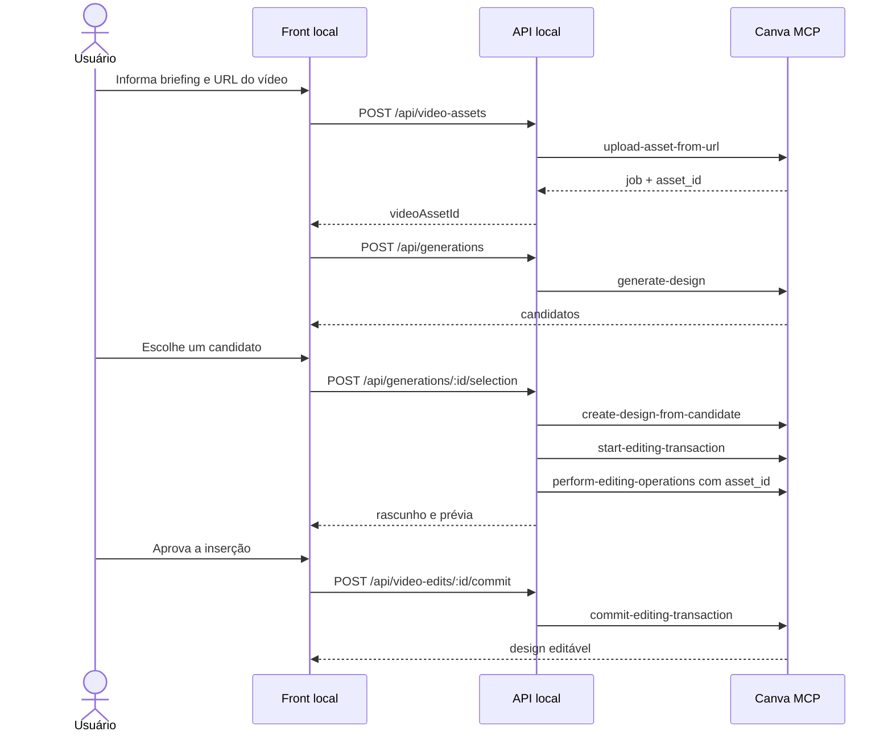

# Implementação — Posts com vídeo no front local do Canva

- **Status:** Planejada
- **Data:** 23 de setembro de 2026
- **Projeto:** `MCP-canva`
- **Dependência:** `TECHSPEC-front-local-canva.md`

## 1. Objetivo

Permitir que o usuário crie, pelo front local, um post que contenha vídeo. O
fluxo deve aceitar um vídeo já disponível por URL pública HTTPS, enviá-lo para
a biblioteca do Canva, inserir o ativo no design escolhido e oferecer a edição
no Canva e a exportação em MP4 quando o formato estiver disponível.

## 2. Situação atual

O MVP atual já consegue:

- receber um briefing;
- gerar candidatos com `generate-design`;
- exigir que o usuário escolha um candidato;
- criar o design editável com `create-design-from-candidate`;
- consultar os formatos de exportação;
- exportar em MP4 quando o Canva anunciar esse formato para o design.

O MVP ainda não envia vídeos para o Canva nem os insere automaticamente no
design. Informar apenas no briefing que o post deve ter vídeo não garante que o
Canva produzirá um design com o vídeo desejado.

## 3. Escopo da implementação

### Primeira versão

- Adicionar ao formulário a opção **Incluir vídeo**.
- Receber uma URL pública HTTPS de um vídeo.
- Validar URL, protocolo e formato antes de chamar o Canva.
- Enviar o vídeo usando `upload-asset-from-url`.
- Acompanhar o job de upload até sucesso ou falha.
- Manter o `asset_id` apenas na memória durante o fluxo.
- Gerar e apresentar normalmente os candidatos de design.
- Depois da escolha humana, criar o design definitivo.
- Abrir uma transação de edição no design criado.
- Inserir ou substituir um preenchimento usando o `asset_id` do vídeo.
- Exibir uma prévia para aprovação quando a ferramenta disponibilizar uma.
- Confirmar a transação somente após ação explícita do usuário.
- Consultar os formatos disponíveis e oferecer MP4 somente quando anunciado.

### Fora da primeira versão

- Geração do conteúdo do vídeo por IA.
- Corte, legendagem, trilha sonora ou edição de timeline no front local.
- Upload direto de arquivo local sem armazenamento intermediário.
- Hospedagem permanente de vídeos.
- Publicação automática em Instagram, TikTok ou YouTube.

## 4. Limitação de arquivos locais

O backend do Canva precisa baixar o arquivo. Por isso, uma URL como
`http://127.0.0.1:3000/video.mp4` ou `http://localhost/video.mp4` não funciona.
O vídeo deve:

- estar em uma URL pública HTTPS;
- responder com HTTP `200`;
- informar um `Content-Type` compatível;
- permanecer disponível até o Canva terminar o upload;
- respeitar os limites de tamanho e formato do Canva.

Para manter o produto estritamente local, a primeira versão aceitará apenas
uma URL pública fornecida pelo usuário. Uma versão posterior poderá enviar um
arquivo local para armazenamento temporário com URL assinada e expiração curta.

## 5. Fluxo MCP



O tipo exato da operação (`insert_fill` ou `update_fill`) deve ser resolvido a
partir do schema anunciado pelo MCP e da estrutura editável retornada pela
transação. O cliente não deve fabricar IDs de elementos ou operações não
anunciadas.

## 6. Alterações no front

Adicionar ao formulário:

- checkbox **Incluir vídeo**;
- campo **URL pública do vídeo**;
- texto explicando que `localhost` não é aceito pelo Canva;
- indicação do progresso do upload;
- estado de falha com possibilidade de nova tentativa explícita;
- confirmação antes de salvar a inserção do vídeo;
- botão de exportação MP4 somente quando suportado.

Estados adicionais:

```text
idle
  → uploading_video
  → generating
  → choosing
  → creating
  → preparing_video_edit
  → awaiting_video_approval
  → committing_video_edit
  → created
  → exporting
```

O briefing, os candidatos e o design criado devem ser preservados quando uma
falha de upload ou edição permitir tentativa segura.

## 7. Novas rotas da API local

### `POST /api/video-assets`

Requisição:

```json
{
  "url": "https://cdn.exemplo.com/campanha/video.mp4"
}
```

Resposta:

```json
{
  "videoAssetId": "asset_EXEMPLO",
  "status": "uploaded"
}
```

### `POST /api/designs/:designId/video-edits`

Abre a transação e aplica a inserção do ativo em rascunho.

```json
{
  "videoAssetId": "asset_EXEMPLO",
  "pageIndex": 1,
  "elementId": "element_EXEMPLO"
}
```

Resposta:

```json
{
  "videoEditId": "tx_EXEMPLO",
  "status": "awaiting_approval",
  "previewUrls": []
}
```

### `POST /api/video-edits/:videoEditId/commit`

Confirma a transação somente após a aprovação do usuário.

### `POST /api/video-edits/:videoEditId/cancel`

Descarta o rascunho sem alterar o design.

## 8. Estado efêmero

O backend manterá temporariamente:

```ts
interface VideoAssetRecord {
  videoAssetId: string;
  sourceHost: string;
  createdAt: number;
  expiresAt: number;
}

interface VideoEditRecord {
  videoEditId: string;
  designId: string;
  transactionId: string;
  status: 'awaiting_approval' | 'committed' | 'cancelled';
  createdAt: number;
  expiresAt: number;
}
```

A URL completa do vídeo não deve ser registrada em logs. Os registros serão
apagados ao reiniciar a API ou após o TTL.

## 9. Segurança

- Aceitar somente `https:`.
- Bloquear `localhost`, endereços IP e hosts de redes privadas.
- Limitar o comprimento da URL.
- Não seguir URLs fornecidas pelo usuário a partir da API local para baixar o
  arquivo; a URL deve ser enviada ao Canva pela ferramenta oficial.
- Não registrar a URL completa, `asset_id`, tokens ou respostas MCP brutas.
- Validar `designId`, `transactionId`, `pageIndex` e `elementId`.
- Não repetir automaticamente upload, commit ou exportação.
- Exigir que o ativo pertença ao fluxo local atual antes de usá-lo.
- Cancelar a transação quando o usuário rejeitar a prévia ou quando ela expirar.

## 10. Testes necessários

### Backend

- URL HTTPS válida é aceita.
- HTTP, localhost, IPs e redes privadas são rejeitados.
- Falha do job de upload gera erro sanitizado.
- `asset_id` é associado ao fluxo correto.
- Candidato continua exigindo escolha humana.
- Inserção permanece em rascunho antes da aprovação.
- Commit e cancelamento usam a mesma transação.
- Escritas concorrentes ou duplicadas são bloqueadas.
- MP4 só é aceito quando anunciado por `get-export-formats`.

### Frontend

- O campo de URL aparece somente quando **Incluir vídeo** está marcado.
- Mensagens deixam clara a exigência de URL pública HTTPS.
- Geração fica bloqueada durante o upload.
- Erros preservam briefing e candidatos quando seguro.
- Nenhuma edição é confirmada sem aprovação explícita.
- MP4 aparece somente entre os formatos retornados pela API.

## 11. Critérios de aceite

- O usuário consegue informar briefing, formato e URL pública de vídeo.
- O vídeo é enviado para a biblioteca da conta autenticada no Canva.
- O design não é criado antes da escolha explícita de um candidato.
- A inserção do vídeo fica em rascunho antes da confirmação.
- Cancelar não modifica o design.
- Confirmar salva o vídeo no design e retorna o link editável.
- O front oferece exportação MP4 somente quando suportada.
- URLs, tokens e respostas MCP brutas não aparecem nos logs.
- Testes, typecheck, lint e build continuam passando.

## 12. Referências oficiais

- [Canva MCP — ferramentas e limites](https://www.canva.dev/docs/apps/mcp/tools/)
- [Canva MCP — upload-asset-from-url](https://www.canva.dev/docs/apps/mcp/tools/upload-asset-from-url/)
- [Canva MCP — generate-design](https://www.canva.dev/docs/apps/mcp/tools/generate-design/)
- [Canva MCP — verificação de fluxos](https://www.canva.dev/docs/apps/mcp/verify-app/)
