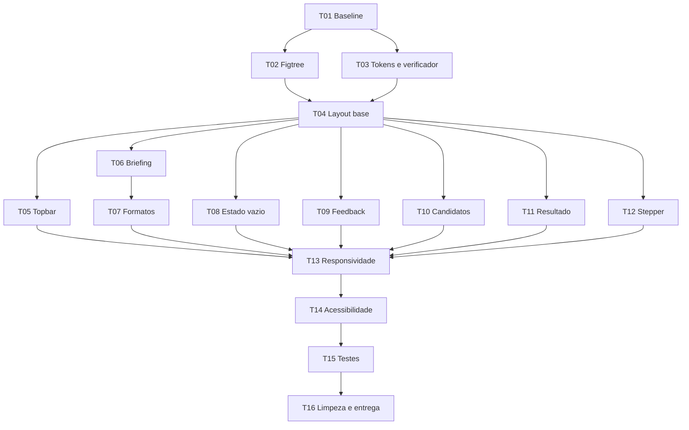

# Tasks — Atualização visual do frontend

- **Status:** Em implementação — código concluído; QA visual manual pendente
- **Origem:** [`TECHSPEC-atualizacao-design-frontend.md`](TECHSPEC-atualizacao-design-frontend.md)
- **Referência visual:** [`GUIA-DE-DESIGN.md`](GUIA-DE-DESIGN.md)
- **Escopo:** `web/`

## Progresso atual

| Tasks | Situação |
|---|---|
| T01–T12 | Implementadas e validadas automaticamente |
| T13 | Breakpoints implementados; inspeção visual manual em 390, 768, 1280 e 1600 px pendente |
| T14 | Semântica e testes acessíveis implementados; navegação manual por teclado e zoom de 200% pendentes |
| T15 | Implementada; 17 testes do frontend passando |
| T16 | Limpeza, paleta, lint, typecheck e build concluídos; commit e revisão visual pendentes |

## 1. Regras para execução

- Não alterar contratos da API local.
- Não alterar OAuth ou integração MCP.
- Não implementar vídeo nesta entrega.
- Não adicionar sidebar ou funcionalidades fictícias.
- Usar somente as seis cores autorizadas na interface.
- Preservar a escolha humana do candidato.
- Manter o frontend funcional ao final de cada fase.
- Executar os testes indicados em cada tarefa antes de marcá-la como concluída.

Paleta permitida:

```text
#000000
#F74D00
#E7E7E8
#E9E3BF
#F9F9F9
#FDDBCC
```

## 2. Ordem e dependências



T05, T08, T09, T10, T11 e T12 podem ser desenvolvidas em paralelo depois de
T04. T06 deve anteceder T07.

## 3. Backlog

### T01 — Registrar baseline funcional

**Status:** ✅ Concluída — baseline automatizado registrado

**Objetivo:** confirmar que o frontend está estável antes da migração visual.

**Arquivos alterados:** nenhum.

**Passos:**

- [ ] Executar os testes atuais do frontend.
- [ ] Executar lint.
- [ ] Executar build.
- [ ] Confirmar que o front responde em `127.0.0.1:5173`.
- [ ] Verificar manualmente os estados inicial, candidatos e resultado quando o
  Canva estiver disponível.
- [ ] Registrar qualquer falha preexistente antes de modificar o CSS.

**Validação:**

```bash
npm --prefix web test
npm --prefix web run lint
npm run web:build
```

**Concluída quando:** os comandos passam ou as falhas preexistentes estão
documentadas.

---

### T02 — Migrar a tipografia para Figtree

**Status:** ✅ Concluída

**Objetivo:** tornar Figtree a única família visual da aplicação.

**Arquivos:**

- `web/app/layout.tsx`
- `web/app/globals.css`

**Passos:**

- [ ] Substituir a importação de Geist por `Figtree`.
- [ ] Carregar pesos 300, 400, 500 e 600.
- [ ] Expor a variável `--font-figtree`.
- [ ] Criar `--font-sans` apontando para Figtree e fallbacks.
- [ ] Remover Georgia e Times New Roman de todos os seletores.
- [ ] Remover pesos não suportados como 650, 760, 770, 800 e 850.
- [ ] Aplicar a escala tipográfica da techspec.
- [ ] Confirmar que a fonte é empacotada pelo build e não requisitada em runtime.

**Critérios de aceite:**

- [ ] Nenhum seletor usa Geist ou fonte serifada.
- [ ] Nenhum peso fora de 300, 400, 500 e 600 permanece.
- [ ] Build do front passa.

---

### T03 — Implantar tokens e verificação da paleta

**Status:** ✅ Concluída

**Objetivo:** criar a fundação visual e impedir regressões de cor.

**Arquivos:**

- `web/app/globals.css`
- `web/scripts/check-ui-palette.mjs` — novo
- `web/package.json`

**Passos:**

- [ ] Substituir os tokens atuais pelos tokens do guia.
- [ ] Adicionar escalas de espaço, raio, sombra, duração e easing.
- [ ] Remover `--teal`, `--teal-dark`, `--coral`, `--lemon`, `--paper`,
  `--ink-soft`, `--surface` e `--line`.
- [ ] Criar script que leia os arquivos CSS versionados.
- [ ] Rejeitar qualquer hexadecimal fora da allowlist de seis cores.
- [ ] Aceitar diferenças entre letras maiúsculas e minúsculas.
- [ ] Ignorar `node_modules`, builds, imagens e conteúdo do usuário.
- [ ] Adicionar script `check:palette` ao `web/package.json`.
- [ ] Usar opacidade de preto e laranja somente nos casos autorizados.

**Validação:**

```bash
npm --prefix web run check:palette
```

**Critérios de aceite:**

- [ ] O script passa com a paleta correta.
- [ ] Um hexadecimal inválido inserido temporariamente faz o script falhar.
- [ ] A cor temporária é removida antes de concluir a tarefa.

---

### T04 — Atualizar layout base e superfícies

**Status:** ✅ Concluída

**Objetivo:** transformar a página em um workspace de produto coerente com o
guia.

**Arquivos:**

- `web/app/globals.css`
- `web/app/page.tsx`

**Passos:**

- [ ] Manter topbar + workspace sem adicionar sidebar.
- [ ] Definir topbar com 76 px e superfície `#F9F9F9`.
- [ ] Aplicar canvas `#E7E7E8`.
- [ ] Aplicar painel de briefing `#F9F9F9`.
- [ ] Limitar o briefing entre 360 e 440 px em desktop.
- [ ] Fazer a direção criativa ocupar o espaço restante.
- [ ] Padronizar paddings com a escala de 4/8 px.
- [ ] Remover gradientes e formas editoriais antigas.
- [ ] Adicionar largura máxima de 1760 px se a composição se estender demais.
- [ ] Garantir que o layout não altere handlers ou estados funcionais.

**Critérios de aceite:**

- [ ] O layout usa apenas tokens.
- [ ] Não existe rolagem horizontal a partir de 390 px.
- [ ] O fluxo de formulário e resultado continua funcionando.

---

### T05 — Atualizar topbar e status da conexão

**Status:** ✅ Concluída

**Objetivo:** alinhar marca e conexão ao novo sistema visual.

**Arquivos:**

- `web/app/page.tsx`
- `web/app/globals.css`
- `web/components/ConnectionStatus.tsx` — opcional

**Passos:**

- [ ] Criar monograma circular laranja com letra preta.
- [ ] Aplicar nome da marca em 16 px e peso 600.
- [ ] Transformar status em controle cápsula.
- [ ] Exibir spinner e texto em `connecting`.
- [ ] Exibir check e texto quando conectado.
- [ ] Exibir ícone de atenção e texto em erro.
- [ ] Não usar somente um ponto colorido para representar status.
- [ ] Preservar clique de reconexão e estado `disabled`.
- [ ] Adicionar nome acessível coerente para cada estado.

**Critérios de aceite:**

- [ ] Os três estados são compreensíveis sem cor.
- [ ] O controle é operável por teclado.
- [ ] A topbar não quebra em 390 px.

---

### T06 — Redesenhar painel de briefing

**Status:** ✅ Concluída

**Objetivo:** aplicar hierarquia de produto ao formulário principal.

**Arquivos:**

- `web/app/page.tsx`
- `web/app/globals.css`

**Passos:**

- [ ] Trocar eyebrow em caixa alta por label curto.
- [ ] Aplicar título em 36/44 px, peso 500.
- [ ] Aplicar corpo em 16/24 px e preto com 62% de opacidade.
- [ ] Atualizar textarea para raio de 12 px e foco laranja.
- [ ] Manter label visível, ajuda e contador.
- [ ] Transformar **Gerar opções** em botão preto e cápsula.
- [ ] Adicionar spinner e texto “Gerando opções” durante geração.
- [ ] Manter área do botão estável durante loading.
- [ ] Preservar validação de 10 a 5.000 caracteres.
- [ ] Preservar nota de privacidade.

**Critérios de aceite:**

- [ ] Formulário funciona por teclado.
- [ ] Loading não altera a largura do painel.
- [ ] Validação e payload continuam iguais.

---

### T07 — Redesenhar seletor de formatos

**Status:** ✅ Concluída

**Objetivo:** tornar seleção clara, acessível e coerente com a paleta.

**Arquivos:**

- `web/app/page.tsx`
- `web/app/globals.css`
- `web/components/FormatSelector.tsx` — recomendado

**Passos:**

- [ ] Preservar radio buttons nativos.
- [ ] Criar cards compactos com altura mínima de 64 px.
- [ ] Usar borda neutra no estado padrão.
- [ ] Usar borda laranja e fundo `#FDDBCC` no selecionado.
- [ ] Adicionar check ou texto que confirme seleção.
- [ ] Implementar focus ring laranja.
- [ ] Manter formatos derivados das capacidades do Canva.
- [ ] Usar duas colunas acima de 480 px e uma abaixo disso.

**Testes:**

- [ ] Renderiza apenas formatos disponíveis.
- [ ] Radio selecionado é anunciado corretamente.
- [ ] Mudança envia o valor esperado na geração.

---

### T08 — Substituir o estado vazio

**Status:** ✅ Concluída

**Objetivo:** remover a composição decorativa antiga e explicar o próximo passo.

**Arquivos:**

- `web/app/page.tsx`
- `web/app/globals.css`
- `web/components/EmptyState.tsx` — recomendado

**Passos:**

- [ ] Remover pôster inclinado, serifas e grade de fundo.
- [ ] Criar card de superfície com raio de 20 px.
- [ ] Criar composição geométrica somente com a paleta permitida.
- [ ] Manter título e descrição curtos.
- [ ] Marcar ilustração decorativa com `aria-hidden`.
- [ ] Integrar visualmente o stepper.
- [ ] Garantir altura estável durante transição para candidatos.

**Critérios de aceite:**

- [ ] Não existe cor fora da allowlist.
- [ ] A mensagem explica que as opções aparecerão após a geração.
- [ ] O conteúdo permanece legível em 390 px.

---

### T09 — Padronizar processamento, erro e feedback

**Status:** ✅ Concluída

**Objetivo:** comunicar estados funcionais sem depender de cores externas.

**Arquivos:**

- `web/app/page.tsx`
- `web/app/globals.css`
- `web/components/FeedbackBanner.tsx` — opcional

**Passos:**

- [ ] Usar `#E9E3BF` no banner de processamento.
- [ ] Usar `#FDDBCC` no banner de erro.
- [ ] Combinar ícone, título e mensagem em cada estado.
- [ ] Manter `aria-live="polite"` para progresso.
- [ ] Manter `role="alert"` para erro.
- [ ] Adicionar `aria-busy` à região em processamento.
- [ ] Parar animações em reduced motion.
- [ ] Preservar ação **Tentar conexão** quando aplicável.
- [ ] Não limpar briefing ou candidatos diante de erro recuperável.

**Testes:**

- [ ] Mensagem de progresso está em região viva.
- [ ] Erro possui role alert.
- [ ] Reconexão continua chamando a API.

---

### T10 — Redesenhar cards de candidato

**Status:** ✅ Concluída

**Objetivo:** aproximar os candidatos dos cards de produto das referências.

**Arquivos:**

- `web/components/CandidateCard.tsx`
- `web/components/CandidateCard.test.tsx`
- `web/app/globals.css`
- `web/app/page.tsx` — se adicionar `isCreating`

**Passos:**

- [ ] Aplicar superfície, raio de 16 px, borda e sombra pequena.
- [ ] Preservar proporção e `object-fit: contain` da miniatura.
- [ ] Atualizar chip numérico.
- [ ] Usar link preto sublinhado em **Ver maior**.
- [ ] Usar botão preto e em cápsula em **Usar este design**.
- [ ] Recolorir fallback usando somente a paleta.
- [ ] Manter texto alternativo específico por opção.
- [ ] Garantir área de toque mínima de 44 px.
- [ ] Identificar visual e textualmente o card em criação.
- [ ] Bloquear escritas concorrentes.
- [ ] Não exibir seleção antes do clique.

**Testes:**

- [ ] Clique envia o `candidateId` correto.
- [ ] Estado disabled bloqueia clique.
- [ ] Fallback permanece acessível.
- [ ] Estado de criação não marca outro candidato.

---

### T11 — Redesenhar resultado e exportações

**Status:** ✅ Concluída

**Objetivo:** tornar a conclusão clara e orientar edição/exportação.

**Arquivos:**

- `web/app/page.tsx`
- `web/app/globals.css`
- `web/components/DesignResult.tsx` — recomendado

**Passos:**

- [ ] Criar card de resultado com superfície e raio de 20 px.
- [ ] Usar check + texto + fundo `#E9E3BF` no sucesso.
- [ ] Aplicar título em 28/36 px.
- [ ] Usar botão preto em **Editar no Canva**.
- [ ] Usar botão secundário em **Criar outro**.
- [ ] Renderizar formatos como controles secundários.
- [ ] Identificar o formato atualmente exportado.
- [ ] Manter links temporários claramente rotulados.
- [ ] Garantir quebra de linha para títulos e URLs extensas.
- [ ] Preservar `target="_blank"` e `rel="noreferrer"`.

**Testes:**

- [ ] Apenas formatos retornados pela API aparecem.
- [ ] Clique exporta o formato correto.
- [ ] Download pronto informa que o link é temporário.
- [ ] Criar outro limpa resultado sem limpar o briefing.

---

### T12 — Implementar stepper semântico

**Status:** ✅ Concluída

**Objetivo:** comunicar claramente a posição do usuário no fluxo.

**Arquivos:**

- `web/app/page.tsx`
- `web/app/globals.css`
- `web/components/ProcessStepper.tsx` — recomendado

**Passos:**

- [ ] Manter etapas Briefing, Escolha e Exporte.
- [ ] Usar check e laranja na etapa concluída.
- [ ] Usar borda laranja e número na etapa atual.
- [ ] Usar borda neutra na etapa futura.
- [ ] Adicionar `aria-current="step"`.
- [ ] Preservar rótulos em mobile.
- [ ] Impedir quebra ou rolagem horizontal da página.

**Testes:**

- [ ] Etapa 1 em idle.
- [ ] Etapa 2 com candidatos.
- [ ] Etapa 3 com design criado.
- [ ] Somente uma etapa usa `aria-current`.

---

### T13 — Consolidar responsividade

**Status:** 🟡 Implementada — validação visual manual pendente

**Objetivo:** fazer a nova composição funcionar nos quatro tamanhos definidos.

**Arquivos:**

- `web/app/globals.css`
- componentes que precisarem de pequenos ajustes estruturais

**Passos:**

- [ ] Validar 390 px.
- [ ] Validar 768 px.
- [ ] Validar 1280 px.
- [ ] Validar 1600 px.
- [ ] Empilhar briefing e direção criativa abaixo de 900 px.
- [ ] Usar uma coluna para formatos abaixo de 480 px.
- [ ] Usar uma coluna para candidatos em mobile.
- [ ] Permitir duas colunas somente com cards de pelo menos 300 px.
- [ ] Tornar botões principais full width em mobile.
- [ ] Empilhar ações quando não houver largura.
- [ ] Garantir que nenhum conteúdo cause overflow horizontal.
- [ ] Testar títulos extensos e muitos formatos.

**Critérios de aceite:**

- [ ] Página sem rolagem horizontal.
- [ ] Nenhum texto ou botão truncado sem alternativa acessível.
- [ ] Ordem visual acompanha a ordem do DOM.

---

### T14 — Revisar acessibilidade e interação

**Status:** 🟡 Implementada — validação manual de teclado e zoom pendente

**Objetivo:** validar o fluxo completo além da aparência.

**Arquivos:** todos os componentes alterados.

**Passos:**

- [ ] Navegar por toda a tela usando apenas teclado.
- [ ] Confirmar foco visível em todos os controles.
- [ ] Confirmar área mínima de 44 × 44 px.
- [ ] Validar headings e landmarks.
- [ ] Validar labels e descrições de campos.
- [ ] Validar nomes acessíveis de botões de ícone.
- [ ] Validar `aria-live`, `role="alert"`, `aria-busy` e `aria-current`.
- [ ] Testar zoom de 200%.
- [ ] Testar `prefers-reduced-motion`.
- [ ] Confirmar preto sobre laranja e `#F9F9F9` sobre preto.
- [ ] Verificar que informação de estado não depende somente de cor.

**Critérios de aceite:**

- [ ] Fluxo principal completo por teclado.
- [ ] Nenhum foco invisível.
- [ ] Nenhum estado comunicado apenas por cor.

---

### T15 — Ampliar testes automatizados

**Status:** ✅ Concluída

**Objetivo:** proteger os comportamentos afetados pela reorganização visual.

**Arquivos:**

- `web/**/*.test.tsx`
- `web/**/*.test.ts`
- `web/test/setup.ts`
- `web/package.json`

**Passos:**

- [ ] Atualizar testes do `CandidateCard`.
- [ ] Testar seletor de formatos.
- [ ] Testar stepper.
- [ ] Testar status de conexão.
- [ ] Testar feedback de erro e loading.
- [ ] Testar resultado e formatos de exportação.
- [ ] Testar ausência de seleção automática.
- [ ] Incluir `check:palette` na validação padrão.
- [ ] Manter testes de `canva-api` inalterados quando possível.

**Validação:**

```bash
npm --prefix web test
npm --prefix web run lint
npm --prefix web run check:palette
npm run web:build
```

**Critérios de aceite:** todos os comandos passam sem warnings acionáveis.

---

### T16 — Limpar CSS e preparar entrega

**Status:** 🟡 Em andamento — validações concluídas; revisão visual e commit pendentes

**Objetivo:** remover resíduos da identidade antiga e finalizar a migração.

**Arquivos:** todos os arquivos modificados na atualização.

**Passos:**

- [ ] Remover classes sem uso.
- [ ] Remover tokens e cores antigas.
- [ ] Buscar referências a Geist, Georgia, teal, coral, lemon e paper.
- [ ] Executar `git diff --check`.
- [ ] Executar toda a suíte final.
- [ ] Revisar o diff para garantir que backend e contratos não mudaram.
- [ ] Atualizar a techspec para `Implementada` após a validação.
- [ ] Atualizar o guia somente se surgir um padrão realmente novo.
- [ ] Criar commit separado para a implementação visual.

**Comandos finais:**

```bash
npm test
npm run typecheck
npm --prefix web test
npm --prefix web run lint
npm --prefix web run check:palette
npm run web:build
git diff --check
```

**Critérios de aceite:**

- [ ] Working tree contém somente mudanças esperadas.
- [ ] Testes, lint, typecheck, paleta e build passam.
- [ ] Nenhuma rota ou payload da API foi alterado.
- [ ] Techspec e tasks refletem o resultado entregue.

## 4. Definition of Done

A atualização está concluída quando:

- [ ] T01 a T16 estão marcadas como concluídas.
- [ ] Figtree é a única fonte da interface.
- [ ] O CSS contém apenas as seis cores autorizadas.
- [ ] A identidade antiga foi completamente removida.
- [ ] Estados funcionais são comunicados por texto e ícone.
- [ ] Todos os candidatos aparecem sem seleção automática.
- [ ] O layout funciona em 390, 768, 1280 e 1600 px.
- [ ] O fluxo é operável por teclado e com zoom de 200%.
- [ ] Backend, OAuth e MCP não sofreram alterações.
- [ ] Todos os comandos finais passam.

## 5. Sugestão de commits

Para facilitar revisão e reversão:

1. `refactor(web): aplica tokens e tipografia do guia`
2. `feat(web): atualiza layout e componentes do fluxo Canva`
3. `test(web): cobre estados e valida paleta da interface`
4. `docs: marca atualização visual como implementada`

Evitar misturar mudanças no backend nesses commits.
