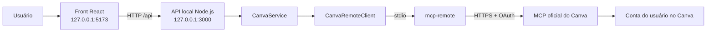

# Tech Spec — Front local para criação de banners no Canva

- **Status:** Implementada (MVP local)
- **Data:** 23 de setembro de 2026
- **Escopo:** MVP local, uso individual
- **Projeto:** `MCP-canva`

## 1. Resumo

Criar uma aplicação web executada somente no computador do usuário para gerar
banners pelo MCP oficial do Canva. O front permitirá escrever o briefing,
escolher o formato, visualizar os candidatos, transformar a opção escolhida em
um design editável e exportá-lo.

O navegador não se conectará diretamente ao Canva. Uma API local reutilizará
`CanvaRemoteClient` e `CanvaService`, que já implementam descoberta de
ferramentas, OAuth via `mcp-remote`, geração, escolha e exportação.

## 2. Objetivos

- Oferecer uma experiência visual simples para o fluxo já disponível na CLI.
- Manter OAuth, tokens e chamadas MCP fora do navegador.
- Exigir escolha humana antes de criar um design definitivo.
- Entregar um link editável do Canva após a escolha.
- Validar formatos disponíveis antes de exportar.
- Manter a solução local preparada para uma futura versão hospedada.

## 3. Fora do escopo do MVP

- Publicação na internet ou acesso por outros dispositivos.
- Cadastro de usuários ou autenticação própria da aplicação.
- Persistência de histórico após reiniciar o backend.
- Banco de dados, filas ou armazenamento de arquivos exportados.
- Editor visual completo dentro da aplicação.
- Edição transacional de elementos do design. No MVP, ajustes finos serão feitos
  pelo link **Editar no Canva**.
- Brand Kits, Brand Templates e Autofill.
- Geração em lote.

Esses itens poderão ser adicionados em fases posteriores sem alterar o fluxo
principal do MVP.

## 4. Arquitetura proposta



### Decisões principais

1. **Front e backend no mesmo repositório:** reduz configuração e permite
   reutilizar diretamente a integração existente.
2. **Backend local obrigatório:** o front não terá acesso a tokens, processos
   locais ou ferramentas MCP.
3. **Bind somente em loopback:** tanto front quanto API usarão `127.0.0.1`, não
   `0.0.0.0`.
4. **Estado efêmero em memória:** suficiente para um MVP individual e evita
   persistir briefings, candidatos ou links assinados.
5. **Canva continua sendo o editor:** a aplicação organiza geração, escolha e
   exportação, mas ajustes visuais avançados permanecem no Canva.

## 5. Organização de arquivos

```text
MCP-canva/
├── web/
│   ├── app/
│   │   ├── layout.tsx
│   │   ├── page.tsx
│   │   └── globals.css
│   ├── components/
│   │   └── CandidateCard.tsx
│   ├── lib/
│   │   ├── canva-api.ts
│   │   └── types.ts
│   ├── package.json
│   ├── vite.config.ts
│   └── vitest.config.ts
├── src/
│   ├── http/
│   │   ├── server.ts
│   │   ├── app.ts
│   │   ├── errors.ts
│   │   ├── connection-manager.ts
│   │   └── generation-store.ts
│   ├── canva-service.ts
│   ├── remote-client.ts
│   └── ...
├── test/
│   ├── ...
│   └── http/
└── resources/
```

O front ficará em `MCP-canva/web`. A integração MCP continuará na raiz para ser
compartilhada pela API web e pela CLI existente.

## 6. Stack

### Frontend

- React 19 com App Router compatível via Vinext.
- TypeScript estrito.
- Vite para desenvolvimento e build.
- CSS próprio com variáveis de tema; nenhuma biblioteca visual obrigatória no
  MVP.
- `fetch` e estado local do React para requisições e fluxo. Uma biblioteca de
  cache não é necessária para o primeiro fluxo.

### Backend local

- Node.js 24.
- TypeScript.
- Fastify para rotas HTTP, validação de tamanho e tratamento consistente de
  erros.
- Integração existente com `@modelcontextprotocol/client` e `mcp-remote`.

### Execução local

- Front: `http://127.0.0.1:5173`.
- API: `http://127.0.0.1:3000`.
- O Vite fará proxy de `/api` para a API, evitando CORS durante o
  desenvolvimento.
- Um comando na raiz iniciará os dois processos.

## 7. Experiência do usuário

### 7.1 Tela principal

Layout responsivo de uma única página:

1. **Cabeçalho:** nome do produto e status da conexão com o Canva.
2. **Painel de briefing:** descrição do banner, tipo do design e botão de
   geração.
3. **Área de progresso:** autenticação, geração e mensagens de erro.
4. **Grade de candidatos:** miniatura, identificação e botão para selecionar.
5. **Resultado:** links para editar/visualizar e opções de exportação.

### 7.2 Campos do briefing

- Descrição obrigatória, entre 10 e 5.000 caracteres.
- Tipo do design, obtido do schema anunciado por `generate-design`.
- Valor inicial: `instagram_post`.
- Atalhos visuais sugeridos: Instagram, Story, Flyer, Poster e YouTube
  Thumbnail, mostrados somente quando suportados pelo schema atual.

### 7.3 Estados do fluxo

```text
idle
  → connecting (quando OAuth ou conexão MCP for necessária)
  → generating
  → choosing
  → creating
  → created
  → exporting
  → created

Qualquer etapa pode ir para error, preservando o briefing e os candidatos já
recebidos quando for seguro tentar novamente.
```

### 7.4 Regras de interação

- O botão **Gerar opções** fica desabilitado durante uma geração.
- O front apresenta todos os candidatos retornados.
- Nenhum candidato é selecionado automaticamente.
- A criação definitiva ocorre somente após o clique em **Usar este design**.
- Depois da criação, o link **Editar no Canva** é a ação principal.
- A exportação só aparece para formatos anunciados por
  `get-export-formats`.
- Links assinados de download devem indicar que são temporários.
- Repetir uma ação de escrita enquanto ela está pendente deve ser bloqueado no
  front e no backend.

## 8. API local

Todas as respostas usam JSON. Erros seguem o envelope:

```json
{
  "error": {
    "code": "CANVA_TOOL_ERROR",
    "message": "Não foi possível concluir a geração.",
    "retryable": true
  }
}
```

Mensagens internas, tokens e respostas brutas do MCP não serão enviadas ao
front.

### `GET /api/health`

Verifica somente se a API local está ativa. Não inicia OAuth.

Resposta `200`:

```json
{ "status": "ok", "version": "1.0.0" }
```

### `GET /api/canva/capabilities`

Conecta ao MCP quando necessário e retorna apenas as capacidades usadas pelo
front.

Resposta `200`:

```json
{
  "connected": true,
  "generationTool": "generate-design",
  "designTypes": ["instagram_post", "your_story", "flyer", "poster"],
  "canExport": true
}
```

Se OAuth for necessário, a requisição permanece em progresso enquanto o fluxo
abre no navegador. O front mostra **Aguardando autorização no Canva**.

### `POST /api/generations`

Inicia a geração de candidatos.

Requisição:

```json
{
  "brief": "Post vertical anunciando 30% de desconto...",
  "designType": "instagram_post"
}
```

Resposta `201`:

```json
{
  "generationId": "job_EXEMPLO",
  "candidates": [
    {
      "candidateId": "candidate_EXEMPLO",
      "previewUrls": ["/api/generations/job_EXEMPLO/candidates/candidate_EXEMPLO/preview/0"],
      "canvaPreviewUrl": "https://www.canva.com/d/EXEMPLO"
    }
  ]
}
```

O backend guarda a associação entre `generationId`, candidatos e thumbnails em
memória por até 30 minutos.

### `GET /api/generations/:generationId/candidates/:candidateId/preview/:index`

Retorna ou redireciona para a miniatura do candidato. O backend usa apenas URLs
armazenadas pela própria geração e valida os domínios oficiais do Canva. A rota
não recebe uma URL arbitrária, prevenindo SSRF.

### `POST /api/generations/:generationId/selection`

Transforma o candidato escolhido em design editável.

Requisição:

```json
{ "candidateId": "candidate_EXEMPLO" }
```

Resposta `201`:

```json
{
  "design": {
    "id": "DAF_EXEMPLO",
    "title": "Semana da Tecnologia",
    "editUrl": "https://www.canva.com/d/EXEMPLO_EDIT",
    "viewUrl": "https://www.canva.com/d/EXEMPLO_VIEW"
  },
  "exportFormats": ["png", "jpg", "pdf"]
}
```

O backend rejeita candidatos que não pertençam à geração informada.

### `GET /api/designs/:designId/export-formats`

Consulta `get-export-formats` e devolve os formatos suportados pelo design.

### `POST /api/designs/:designId/exports`

Requisição:

```json
{ "format": "png" }
```

Resposta `201`:

```json
{
  "format": "png",
  "urls": ["https://export-download.canva.com/EXEMPLO.png"],
  "expires": true
}
```

Antes da exportação, o backend confirma novamente que o formato é suportado.

## 9. Gerenciamento da conexão MCP

- A API mantém uma única instância de `CanvaRemoteClient` por processo.
- A conexão é criada de forma preguiçosa na primeira rota que precisar do
  Canva.
- Chamadas simultâneas enquanto a conexão está sendo criada compartilham a
  mesma `Promise`, evitando múltiplas janelas OAuth.
- Se a conexão fechar, a referência é descartada e a próxima chamada tenta
  reconectar.
- O encerramento da API chama `close()` antes de finalizar o processo.
- `CANVA_MCP_TIMEOUT_MS` permanece configurável; geração usa o limite atual de
  120 segundos por chamada.
- A API não oferece ao front uma rota genérica para executar ferramentas MCP.

## 10. Estado efêmero

O backend mantém um `GenerationStore` em memória:

```ts
interface GenerationRecord {
  generationId: string;
  createdAt: number;
  expiresAt: number;
  candidates: Array<{
    candidateId: string;
    canvaPreviewUrl?: string;
    thumbnailUrls: string[];
  }>;
  selectedCandidateId?: string;
  designId?: string;
}
```

Regras:

- TTL de 30 minutos.
- Limpeza periódica e no acesso.
- Máximo de 20 gerações mantidas; a mais antiga é descartada ao exceder o
  limite.
- Nenhum token OAuth, briefing completo ou link de exportação é persistido.
- Reiniciar a API limpa o estado; designs já criados continuam disponíveis no
  Canva.

## 11. Segurança e privacidade

- Servidores vinculados somente a `127.0.0.1`.
- CORS desabilitado em produção local; no desenvolvimento, permitir apenas a
  origem exata do Vite.
- Corpo JSON limitado a 16 KB.
- Validação de todos os parâmetros e IDs antes de chamar o Canva.
- `designType` deve pertencer ao enum anunciado pelo schema atual.
- `format` deve pertencer à resposta de `get-export-formats`.
- Miniaturas só podem vir de registros criados pelo backend e de domínios
  oficiais permitidos (`canva.com`, `canva.ai` e subdomínios necessários).
- Logs não contêm tokens, respostas OAuth, URLs assinadas de exportação nem
  conteúdo integral do briefing.
- Respostas de erro são sanitizadas.
- `.env`, `.mcp-auth` e arquivos de log continuam ignorados pelo Git.
- O front não recebe Client Secret, access token ou refresh token.

## 12. Tratamento de erros

| Código | HTTP | Situação | Comportamento do front |
|---|---:|---|---|
| `VALIDATION_ERROR` | 400 | Briefing, formato ou ID inválido | Destacar o campo |
| `GENERATION_NOT_FOUND` | 404 | Geração expirada ou inexistente | Pedir nova geração |
| `CANDIDATE_NOT_FOUND` | 404 | Candidato fora da geração | Atualizar candidatos |
| `CANVA_AUTH_REQUIRED` | 401 | Autorização não concluída | Mostrar instrução de login |
| `CANVA_PERMISSION_DENIED` | 403 | Plano ou permissão insuficiente | Explicar a limitação |
| `CANVA_TOOL_UNAVAILABLE` | 409 | Ferramenta não anunciada | Bloquear a função afetada |
| `CANVA_RATE_LIMITED` | 429 | Limite do Canva | Informar quando tentar novamente |
| `CANVA_TIMEOUT` | 504 | Geração excedeu o tempo | Permitir nova tentativa segura |
| `CANVA_TOOL_ERROR` | 502 | Falha retornada pela ferramenta | Exibir mensagem sanitizada |
| `INTERNAL_ERROR` | 500 | Erro não classificado | Oferecer tentativa novamente |

Requisições de escrita não serão repetidas automaticamente, para evitar designs
ou exports duplicados. Retentativas exigem ação explícita do usuário.

## 13. Acessibilidade e responsividade

- Fluxo completo operável por teclado.
- Foco visível e ordem lógica de tabulação.
- Cada miniatura tem texto alternativo identificando a opção.
- Estados de carregamento usam `aria-live` sem anunciar continuamente.
- Erros são associados aos respectivos campos.
- Contraste mínimo WCAG AA.
- Botões têm área de toque mínima de 44 × 44 px.
- Em telas estreitas, formulário e candidatos ficam em uma coluna.
- Não depender apenas de cor para comunicar seleção, sucesso ou erro.
- Respeitar `prefers-reduced-motion`.

## 14. Testes

### Backend

- Rotas com `CanvaService` simulado.
- Validação de briefing, design type, IDs e formato.
- Rejeição de candidato que não pertence à geração.
- Expiração e limite do `GenerationStore`.
- Exportação sempre precedida pela consulta de formatos.
- Sanitização de erros MCP.
- Allowlist de hosts das miniaturas.
- Conexão MCP única mesmo com requisições concorrentes.

### Frontend

- Validação do formulário.
- Renderização dos estados principais.
- Geração não cria design automaticamente.
- Seleção envia o `candidateId` correto.
- Exportação mostra somente formatos suportados.
- Erro preserva briefing e candidatos quando aplicável.
- Navegação por teclado e nomes acessíveis.

### Integração local

1. Iniciar front e API com um único comando.
2. Autorizar a conta pelo navegador.
3. Gerar candidatos para `instagram_post`.
4. Confirmar que nenhum design foi criado antes da escolha.
5. Escolher um candidato e abrir o link editável.
6. Consultar os formatos do novo design.
7. Exportar em PNG e abrir o link temporário.
8. Reiniciar a API e confirmar que o design permanece no Canva, mas o estado
   local foi limpo.

## 15. Critérios de aceite

- A aplicação inicia localmente com um único comando documentado.
- A interface indica claramente quando aguarda OAuth, geração ou criação.
- O usuário consegue informar briefing e tipo de design.
- Todos os candidatos retornados são apresentados com identificação e prévia.
- A aplicação não escolhe um candidato automaticamente.
- A opção escolhida gera um design editável e exibe o link do Canva.
- A exportação só aceita formatos anunciados para o design.
- Tokens e credenciais não aparecem no front, logs ou repositório.
- Backend e front passam em typecheck, testes e build.
- A CLI existente continua funcionando sem regressões.

## 16. Plano de implementação

### Fase 1 — Fundação

- Criar `web/` com React, TypeScript e Vite.
- Criar API local e gerenciamento de conexão MCP.
- Adicionar comando único de desenvolvimento.
- Implementar health check e capabilities.

### Fase 2 — Fluxo principal

- Implementar formulário e estados da geração.
- Criar `GenerationStore`.
- Exibir candidatos e miniaturas.
- Implementar escolha e criação do design.

### Fase 3 — Exportação e qualidade

- Consultar formatos e exportar.
- Finalizar responsividade e acessibilidade.
- Adicionar testes de backend, front e integração.
- Atualizar README com instalação e operação local.

### Fase posterior — Edição assistida

- Abrir transação de edição.
- Apresentar elementos editáveis e miniaturas.
- Aplicar operações em rascunho.
- Exigir aprovação explícita antes do commit ou cancelar a transação.
- Implementar posts com vídeo conforme
  [`IMPLEMENTACAO-posts-com-video.md`](IMPLEMENTACAO-posts-com-video.md).

## 17. Migração futura para hospedagem

Para publicar o produto, não basta hospedar o front atual. Será necessário:

- Cadastrar uma aplicação no Canva Developer Portal.
- Trocar o processo local `mcp-remote` por um cliente HTTP com OAuth por usuário.
- Usar backend hospedado para proteger Client Secret e tokens.
- Adicionar sessão autenticada, armazenamento criptografado e isolamento por
  usuário.
- Persistir jobs e candidatos com TTL.
- Configurar redirects OAuth para os domínios de produção.
- Aplicar rate limiting, proteção CSRF e observabilidade adequada.

A separação proposta entre `web`, API e `CanvaService` reduz essa migração: o
front e os contratos podem ser preservados, enquanto conexão, sessão e
persistência são substituídas no backend.

## 18. Questões abertas

- Nome definitivo e identidade visual da aplicação.
- Quais cinco formatos terão atalhos no primeiro lançamento.
- Se o histórico local será necessário após o MVP.
- Se imagens próprias deverão ser enviadas ao Canva no fluxo de criação.
- Quando incorporar edição transacional dentro do front.
